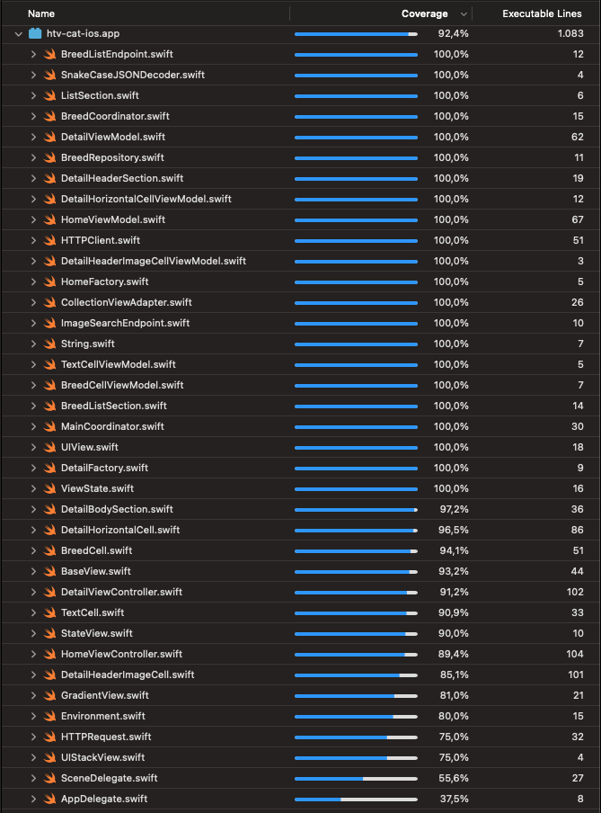

# CatList

CatList is an iOS app that consumes the [TheCatAPI](https://thecatapi.com/) to show a list of cats and its details.

## Video

### What I used

- Xcode 14.3.1 (14E300c)
- Swift 5
- Swift Package Manager
- MVVM-C (Model-View-ViewModel-Coordinator)
- Combine
- Layout:
    - View code
    - XIB

### Libraries

- [Kingfisher](https://github.com/onevcat/Kingfisher) (to load image from network and cache them)
- [CombineSchedulers](https://github.com/pointfreeco/combine-schedulers) (to make Combine more testable)
- [SnapshotTesting](https://github.com/pointfreeco/swift-snapshot-testing)

### Snapshot tests

The snapshot tests were recorded with iPhone 14 Pro Max simulator. Use it to run the unit tests, otherwise some tests may fail.

### Code Coverage

The project has a code coverage of 91.5%.

